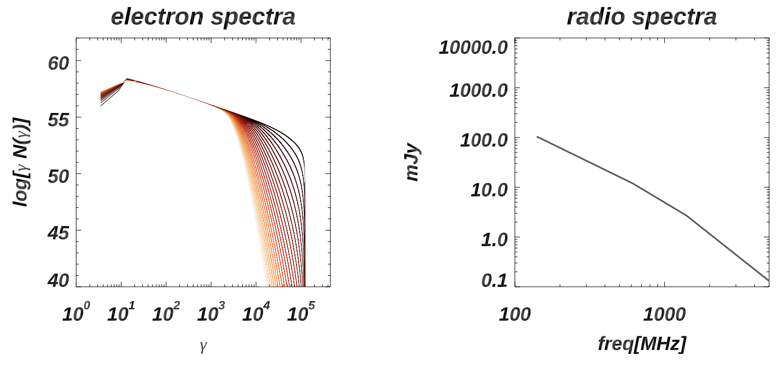

# IDL_FP

This is the public version of the cosmic ray solver (e.g. Fokker Planck without diffusion terms) written in IDL, that we used in Inchingolo, Wittor, Rajpurohit & Vazza 2021, to study the advection, aging and re-acceleration of cosmic ray electrons in the simulated intracluster medium. The code has been developed since ~2019 by F.Vazza. 

The code requires as input a sequence of tracers data, written in column format (see attached example file "input_fam2.dat.txt") and it computes relativistic electrons spectra under radiative and coulomb losses, adiabatic compression/rarefaction, and injection+re-acceleration by shock waves. 

* The main code is FP_public.pro, which requires the pre-compilation of needs.pro to load a  few useful modules. 

     - The code generates the evolution of electron spectra over time, and the final sychrotron emission for a given set of observing frequencies, assuming an arbitrary distance for the source. 

* Details on the method and on its application to cosmological simulations are described in Inchingolo, Wittor, Rajpurohit & Vazza 2021 (MNRAS, submitted, as of this writing). 

